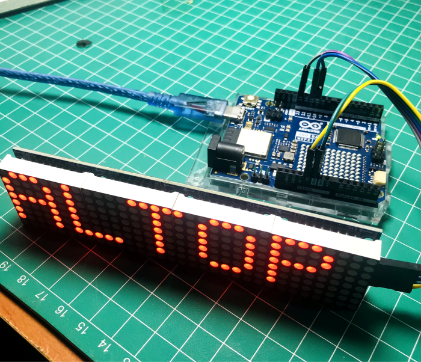

# Menggunakan LED Dot Matrix Module MAX7219 dengan Arduino UNO

> [!NOTE]
> Halo semuanya, kali ini kita akan belajar untuk menampilkan sebuah text di Modul Dot Matrix Max7219




## ⚙️ Komponen yang Diperlukan
|No | Komponen | Jumlah | Deskripsi |
| --- | --- | --- | --- |
| 1 | Arduino UNO | 1 | [link](https://shope.ee/2LA9ZZRSl4) |
| 2 | Kabel Jumper Male to Female | 5 | [link](https://shope.ee/5V7BLyRKg1) |
| 3 | LED Dot Matrix MAX7219 | 1 | [link](https://shope.ee/9KK0btNKqP) |

## 💡 Software dan Librari yang digunakan
|No | Komponen | Deskripsi |
| --- | --- | --- |
| 1 | Arduino IDE | [Download](https://www.arduino.cc/en/software) |
| 2 | Librari MD_MAX72XX | [Download](https://downloads.arduino.cc/libraries/github.com/MajicDesigns/MD_MAX72XX-3.5.1.zip?_gl=1*1lbvcki*_ga*MjkyMTI4NTA4LjE2OTc5NDMyNjE.*_ga_NEXN8H46L5*MTcwODY3MjA3Ny42MS4xLjE3MDg2NzIzNjAuMC4wLjA.*_fplc*V29pNmc5bGZZJTJCTmdsYXplZFhUSE1TV1FMWnQlMkJUJTJGUG5vcEJId3Q5ZVJMb0RjWUhHRkJ1OHl0b1ZxckNKQ3ZZZHhwdU40bzdaWDhNZTVzZHVCcUdEOUVNb0E1bXIlMkJJSEpDQTlJakZNOUtkRWVkOFRoWkJ5NSUyQllOJTJGQVNIc0p3JTNEJTNE) |
| 3 | Librari MD_Parola | [Download](https://downloads.arduino.cc/libraries/github.com/MajicDesigns/MD_Parola-3.7.2.zip?_gl=1*lhrqsw*_ga*MjkyMTI4NTA4LjE2OTc5NDMyNjE.*_ga_NEXN8H46L5*MTcwODY3MjA3Ny42MS4xLjE3MDg2NzI0NDIuMC4wLjA.*_fplc*bUIxNk9sRFFRcEY1empYZ3FRdTJOaXdMOTE4TTRoTUNmcVNaUHBQYmlyTGx0RlgxUzJBOElaNjJCT3NrbVFHN3UzRkxYT1I3b2NUcU9vaUNMZkRRakhqWnBldUVVT1BPMk9tZ3FmUVpOVXAwZURhVDlldUNFMlJuYUc1SXB3JTNEJTNE) |

## ⌛️ Tahapan Pengerjaan


<details>
<summary>1️⃣ Rangkai Alat seperti gambar berikut</summary>

| LCD I2C | Arduino UNO |
| --- | --- |
| VCC | 5V |
| GND | GND |
| DIN | 11 |
| CS | 10 |
| CLK | 13 | 
  

</details>


<details>
<summary>2️⃣ Mendapatkan Alamat i2c dari LCD</summary>

### Jalankan Kode berikut di Arduino IDE setelah merangkai alat

  ```C++
#include <Wire.h>
 
void setup() {
  Wire.begin();
  Serial.begin(115200);
  Serial.println("\nI2C Scanner");
}
 
void loop() {
  byte error, address;
  int nDevices;
  Serial.println("Scanning...");
  nDevices = 0;
  for(address = 1; address < 127; address++ ) {
    Wire.beginTransmission(address);
    error = Wire.endTransmission();
    if (error == 0) {
      Serial.print("I2C device found at address 0x");
      if (address<16) {
        Serial.print("0");
      }
      Serial.println(address,HEX);
      nDevices++;
    }
    else if (error==4) {
      Serial.print("Unknow error at address 0x");
      if (address<16) {
        Serial.print("0");
      }
      Serial.println(address,HEX);
    }    
  }
  if (nDevices == 0) {
    Serial.println("No I2C devices found\n");
  }
  else {
    Serial.println("done\n");
  }
  delay(5000);          
}
```
### Setelah berhasil upload, buka serial monitor untuk melihat hasil nya. 0x27 adakah alamat i2c nya. Copy dan paste alamat tersebut nanti di Kode Program Utama


</details>


<details>
<summary>3️⃣ Install Library LiquidCrystal_i2c </summary>


  - Download Librari LiquidCrystal di atas
  - Masuk ke software Arduino IDE, pilih Sketch > Include Library > add .ZIP Library
  - 

  - Pilih File zip yang sudah kamu download di langkah 1
  - Klik Open dan jika berhasil akan muncul tulisan " Library installed "
</details>

<details>
<summary>4️⃣ Tulis Kode Utama berikut di Arduino IDE</summary>

  ```C++
#include <LiquidCrystal_I2C.h>
LiquidCrystal_I2C lcd(0x27, 16, 2);  

void setup(){
  lcd.init();                    
  lcd.backlight();
}

void loop(){
  lcd.setCursor(0, 0);
  lcd.print("Selamat pagii");
  delay(1000);
  lcd.clear();
  lcd.setCursor(1,1);
  lcd.print("Semangat senin !!");
  delay(1000);
  lcd.clear(); 
}
```

</details>

<details>
<summary>5️⃣ Upload Kode yang sudah kamu tulis di Arduino IDE</summary>

</details>

## 🆘 Troubleshoot
Jika Kode tidak berjalan atau eror atau tidak muncul apa apa di LCD, pastikan mengecek beberapa hal berikut
1. Library LiquidCrystall sudah di install
2. Kabel SDA dan SCL tidak terbalik
3. Putar kekanan atau kekiri Potensiometer berwarna biru yang ada dibelakang LCD


