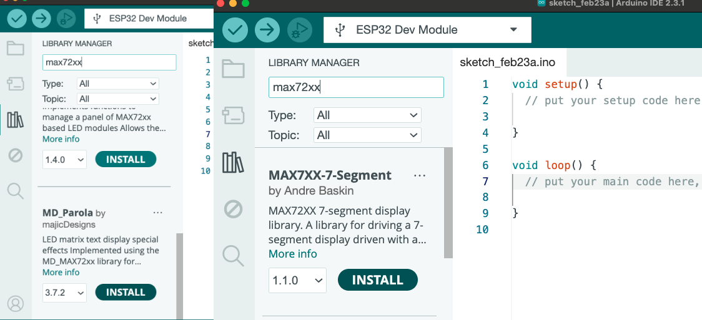

# Menggunakan LED Dot Matrix Module MAX7219 dengan Arduino UNO

> [!NOTE]
> Halo semuanya, kali ini kita akan belajar untuk menampilkan sebuah text di Modul Dot Matrix Max7219


## ⚙️ Komponen yang Diperlukan
|No | Komponen | Jumlah | Deskripsi |
| --- | --- | --- | --- |
| 1 | Arduino UNO | 1 | [link](https://shope.ee/2LA9ZZRSl4) |
| 2 | Kabel Jumper Male to Female | 5 | [link](https://shope.ee/5V7BLyRKg1) |
| 3 | LED Dot Matrix MAX7219 | 1 | [link](https://shope.ee/9KK0btNKqP) |

## 💡 Software dan Librari yang digunakan
|No | Komponen | Deskripsi |
| --- | --- | --- |
| 1 | Arduino IDE | [Download](https://www.arduino.cc/en/software) |
| 2 | Librari MD_MAX72XX | [Download](https://downloads.arduino.cc/libraries/github.com/MajicDesigns/MD_MAX72XX-3.5.1.zip?_gl=1*1lbvcki*_ga*MjkyMTI4NTA4LjE2OTc5NDMyNjE.*_ga_NEXN8H46L5*MTcwODY3MjA3Ny42MS4xLjE3MDg2NzIzNjAuMC4wLjA.*_fplc*V29pNmc5bGZZJTJCTmdsYXplZFhUSE1TV1FMWnQlMkJUJTJGUG5vcEJId3Q5ZVJMb0RjWUhHRkJ1OHl0b1ZxckNKQ3ZZZHhwdU40bzdaWDhNZTVzZHVCcUdEOUVNb0E1bXIlMkJJSEpDQTlJakZNOUtkRWVkOFRoWkJ5NSUyQllOJTJGQVNIc0p3JTNEJTNE) |
| 3 | Librari MD_Parola | [Download](https://downloads.arduino.cc/libraries/github.com/MajicDesigns/MD_Parola-3.7.2.zip?_gl=1*lhrqsw*_ga*MjkyMTI4NTA4LjE2OTc5NDMyNjE.*_ga_NEXN8H46L5*MTcwODY3MjA3Ny42MS4xLjE3MDg2NzI0NDIuMC4wLjA.*_fplc*bUIxNk9sRFFRcEY1empYZ3FRdTJOaXdMOTE4TTRoTUNmcVNaUHBQYmlyTGx0RlgxUzJBOElaNjJCT3NrbVFHN3UzRkxYT1I3b2NUcU9vaUNMZkRRakhqWnBldUVVT1BPMk9tZ3FmUVpOVXAwZURhVDlldUNFMlJuYUc1SXB3JTNEJTNE) |

## ⌛️ Tahapan Pengerjaan


<details>
<summary>1️⃣ Rangkai Alat seperti gambar berikut</summary>

| LCD I2C | Arduino UNO |
| --- | --- |
| VCC | 5V |
| GND | GND |
| DIN | 11 |
| CS | 10 |
| CLK | 13 | 
  

</details>


<details>
<summary>2️⃣ Install Librari yang diperlukan di atas</summary>



</details>


<details>
<summary>3️⃣ Tulis Kode Utama berikut di Arduino IDE</summary>

  ```C++
#include <MD_Parola.h>  
#include <MD_MAX72xx.h>
#include <SPI.h>  

const uint16_t WAIT_TIME = 1000;

#define HARDWARE_TYPE MD_MAX72XX::FC16_HW

#define MAX_DEVICES 4  
#define CLK_PIN   13   
#define DATA_PIN  11  
#define CS_PIN    10   

MD_Parola Mx = MD_Parola(HARDWARE_TYPE, CS_PIN, MAX_DEVICES);

void setup()
{
  Mx.begin();         // instruksi untuk memulai 
  Mx.setIntensity(3); // instruksi untuk mengatur intensitas cahaya (0-15)
}

void loop()
{
  Mx.print("ALTOP");  // instruksi untuk menampilkan karakter
  delay(1000);
  Mx.displayClear();
  delay(1000);
}
```

</details>
<details>
<summary> 4️⃣ Ini Kode kalau ingin Textnya berjalan</summary>

  ```C++
// Use the Parola library to scroll text on the display
//
// Demonstrates the use of the scrolling function to display text received
// from the serial interface
//
// User can enter text on the serial monitor and this will display as a
// scrolling message on the display.
// Speed for the display is controlled by a pot on SPEED_IN analog in.
// Scrolling direction is controlled by a switch on DIRECTION_SET digital in.
// Invert ON/OFF is set by a switch on INVERT_SET digital in.
//
// UISwitch library can be found at https://github.com/MajicDesigns/MD_UISwitch
// MD_MAX72XX library can be found at https://github.com/MajicDesigns/MD_MAX72XX
//
 
#include <MD_Parola.h>
#include <MD_MAX72xx.h>
#include <SPI.h>
 
// set to 1 if we are implementing the user interface pot, switch, etc
#define USE_UI_CONTROL 0
 
#if USE_UI_CONTROL
#include <MD_UISwitch.h>
#endif
 
// Turn on debug statements to the serial output
#define DEBUG 0
 
#if DEBUG
#define PRINT(s, x) { Serial.print(F(s)); Serial.print(x); }
#define PRINTS(x) Serial.print(F(x))
#define PRINTX(x) Serial.println(x, HEX)
#else
#define PRINT(s, x)
#define PRINTS(x)
#define PRINTX(x)
#endif
 
// Define the number of devices we have in the chain and the hardware interface
// NOTE: These pin numbers will probably not work with your hardware and may
// need to be adapted
#define HARDWARE_TYPE MD_MAX72XX::FC16_HW
#define MAX_DEVICES 4
#define CLK_PIN   13
#define DATA_PIN  11
#define CS_PIN    10
 
// HARDWARE SPI
MD_Parola P = MD_Parola(HARDWARE_TYPE, CS_PIN, MAX_DEVICES);
// SOFTWARE SPI
//MD_Parola P = MD_Parola(HARDWARE_TYPE, DATA_PIN, CLK_PIN, CS_PIN, MAX_DEVICES);
 
// Scrolling parameters
#if USE_UI_CONTROL
const uint8_t SPEED_IN = A5;
const uint8_t DIRECTION_SET = 8;  // change the effect
const uint8_t INVERT_SET = 9;     // change the invert
 
const uint8_t SPEED_DEADBAND = 5;
#endif // USE_UI_CONTROL
 
uint8_t scrollSpeed = 60;    // default frame delay value
textEffect_t scrollEffect = PA_SCROLL_LEFT;
textPosition_t scrollAlign = PA_LEFT;
uint16_t scrollPause = 500; // in milliseconds
 
// Global message buffers shared by Serial and Scrolling functions
#define BUF_SIZE    75
char curMessage[BUF_SIZE] = { "FOLLOW @ALTOPACADEMY" };
char newMessage[BUF_SIZE] = { "BELAJAR IOT DULU GAES" };
bool newMessageAvailable = true;
 
#if USE_UI_CONTROL
 
MD_UISwitch_Digital uiDirection(DIRECTION_SET);
MD_UISwitch_Digital uiInvert(INVERT_SET);
 
void doUI(void)
{
  // set the speed if it has changed
  {
    int16_t speed = map(analogRead(SPEED_IN), 0, 1023, 10, 150);
 
    if ((speed >= ((int16_t)P.getSpeed() + SPEED_DEADBAND)) ||
      (speed <= ((int16_t)P.getSpeed() - SPEED_DEADBAND)))
    {
      P.setSpeed(speed);
      scrollSpeed = speed;
      PRINT("\nChanged speed to ", P.getSpeed());
    }
  }
 
  if (uiDirection.read() == MD_UISwitch::KEY_PRESS) // SCROLL DIRECTION
  {
    PRINTS("\nChanging scroll direction");
    scrollEffect = (scrollEffect == PA_SCROLL_LEFT ? PA_SCROLL_RIGHT : PA_SCROLL_LEFT);
    P.setTextEffect(scrollEffect, scrollEffect);
    P.displayClear();
    P.displayReset();
  }
 
  if (uiInvert.read() == MD_UISwitch::KEY_PRESS)  // INVERT MODE
  {
    PRINTS("\nChanging invert mode");
    P.setInvert(!P.getInvert());
  }
}
#endif // USE_UI_CONTROL
 
void readSerial(void)
{
  static char *cp = newMessage;
 
  while (Serial.available())
  {
    *cp = (char)Serial.read();
    if ((*cp == '\n') || (cp - newMessage >= BUF_SIZE-2)) // end of message character or full buffer
    {
      *cp = '\0'; // end the string
      // restart the index for next filling spree and flag we have a message waiting
      cp = newMessage;
      newMessageAvailable = true;
    }
    else  // move char pointer to next position
      cp++;
  }
}
 
void setup()
{
  Serial.begin(57600);
  Serial.print("\n[Parola Scrolling Display]\nType a message for the scrolling display\nEnd message line with a newline");
 
#if USE_UI_CONTROL
  uiDirection.begin();
  uiInvert.begin();
  pinMode(SPEED_IN, INPUT);
 
  doUI();
#endif // USE_UI_CONTROL
 
  P.begin();
  P.setIntensity(1);
  P.displayText(curMessage, scrollAlign, scrollSpeed, scrollPause, scrollEffect, scrollEffect);
}
 
void loop()
{
#if USE_UI_CONTROL
  doUI();
#endif // USE_UI_CONTROL
 
  if (P.displayAnimate())
  {
    if (newMessageAvailable)
    {
      strcpy(curMessage, newMessage);
      newMessageAvailable = false;
    }
    P.displayReset();
  }
  readSerial();
}
```

</details>


<details>
<summary>5️⃣ Upload Kode yang sudah kamu tulis di Arduino IDE</summary>

</details>

## 🆘 Troubleshoot


